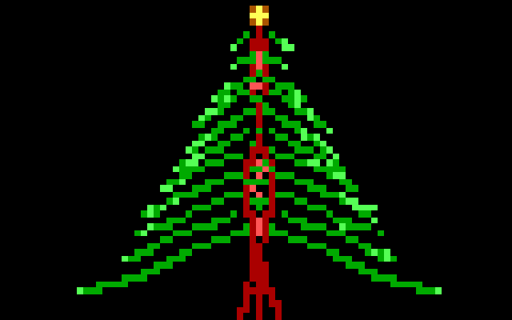

# advent-of-code

## Advent of Code Solutions  
by Georg Begerow

Language: Rust V2021 stable
Level: Beginner / Intermediate in Rust

Goal: Practicing Rust, learning new things, have *fun*

Original project structure lousely based on https://github.com/jocelyn-stericker/aoc, inspirations from https://github.com/ChristopherBiscardi/advent-of-code and https://github.com/maneatingape/advent-of-code-rust

## 2024
| Day | Title              | Status |
| --- | ------------------ | ------ |
| 01  | Historian Hysteria | ⭐⭐     |
| 02  | Red-Nosed Reports  | ⭐⭐     |
| 03  | Mull It Over       | ⭐⭐     |
| 04  |                    |        |
| 05  |                    |        |
| 06  |                    |        |
| 07  |                    |        |
| 08  |                    |        |
| 08  |                    |        |
| 09  |                    |        |
| 10  |                    |        |
| 11  |                    |        |
| 12  |                    |        |
| 13  |                    |        |
| 14  |                    |        |
| 15  |                    |        |
| 16  |                    |        |
| 17  |                    |        |
| 18  |                    |        |
| 19  |                    |        |
| 20  |                    |        |
| 21  |                    |        |
| 22  |                    |        |
| 23  |                    |        |
| 24  |                    |        |
| 25  |                    |        |

## 2023
| Day | Title | Status |
| --- | ----- | ------ |
| 01  |       |        |
| 02  |       |        |
| 03  |       |        |
| 04  |       |        |
| 05  |       |        |
| 06  |       |        |
| 07  |       |        |
| 08  |       |        |
| 08  |       |        |
| 09  |       |        |
| 10  |       |        |
| 11  |       |        |
| 12  |       |        |
| 13  |       |        |
| 14  |       |        |
| 15  |       |        |
| 16  |       |        |
| 17  |       |        |
| 18  |       |        |
| 19  |       |        |
| 20  |       |        |
| 21  |       |        |
| 22  |       |        |
| 23  |       |        |
| 24  |       |        |
| 25  |       |        |

## 2022
| Day | Title | Status |
| --- | ----- | ------ |
| 01  |       |        |
| 02  |       |        |
| 03  |       |        |
| 04  |       |        |
| 05  |       |        |
| 06  |       |        |
| 07  |       |        |
| 08  |       |        |
| 08  |       |        |
| 09  |       |        |
| 10  |       |        |
| 11  |       |        |
| 12  |       |        |
| 13  |       |        |
| 14  |       |        |
| 15  |       |        |
| 16  |       |        |
| 17  |       |        |
| 18  |       |        |
| 19  |       |        |
| 20  |       |        |
| 21  |       |        |
| 22  |       |        |
| 23  |       |        |
| 24  |       |        |
| 25  |       |        |

## 2021
| Day | Title | Status |
| --- | ----- | ------ |
| 01  |       |        |
| 02  |       |        |
| 03  |       |        |
| 04  |       |        |
| 05  |       |        |
| 06  |       |        |
| 07  |       |        |
| 08  |       |        |
| 08  |       |        |
| 09  |       |        |
| 10  |       |        |
| 11  |       |        |
| 12  |       |        |
| 13  |       |        |
| 14  |       |        |
| 15  |       |        |
| 16  |       |        |
| 17  |       |        |
| 18  |       |        |
| 19  |       |        |
| 20  |       |        |
| 21  |       |        |
| 22  |       |        |
| 23  |       |        |
| 24  |       |        |
| 25  |       |        |

## 2020
| Day | Title | Status |
| --- | ----- | ------ |
| 01  |       |        |
| 02  |       |        |
| 03  |       |        |
| 04  |       |        |
| 05  |       |        |
| 06  |       |        |
| 07  |       |        |
| 08  |       |        |
| 08  |       |        |
| 09  |       |        |
| 10  |       |        |
| 11  |       |        |
| 12  |       |        |
| 13  |       |        |
| 14  |       |        |
| 15  |       |        |
| 16  |       |        |
| 17  |       |        |
| 18  |       |        |
| 19  |       |        |
| 20  |       |        |
| 21  |       |        |
| 22  |       |        |
| 23  |       |        |
| 24  |       |        |
| 25  |       |        |

## 2019
| Day | Title | Status |
| --- | ----- | ------ |
| 01  |       |        |
| 02  |       |        |
| 03  |       |        |
| 04  |       |        |
| 05  |       |        |
| 06  |       |        |
| 07  |       |        |
| 08  |       |        |
| 08  |       |        |
| 09  |       |        |
| 10  |       |        |
| 11  |       |        |
| 12  |       |        |
| 13  |       |        |
| 14  |       |        |
| 15  |       |        |
| 16  |       |        |
| 17  |       |        |
| 18  |       |        |
| 19  |       |        |
| 20  |       |        |
| 21  |       |        |
| 22  |       |        |
| 23  |       |        |
| 24  |       |        |
| 25  |       |        |

## 2018
| Day | Title | Status |
| --- | ----- | ------ |
| 01  |       |        |
| 02  |       |        |
| 03  |       |        |
| 04  |       |        |
| 05  |       |        |
| 06  |       |        |
| 07  |       |        |
| 08  |       |        |
| 08  |       |        |
| 09  |       |        |
| 10  |       |        |
| 11  |       |        |
| 12  |       |        |
| 13  |       |        |
| 14  |       |        |
| 15  |       |        |
| 16  |       |        |
| 17  |       |        |
| 18  |       |        |
| 19  |       |        |
| 20  |       |        |
| 21  |       |        |
| 22  |       |        |
| 23  |       |        |
| 24  |       |        |
| 25  |       |        |

## 2017
| Day | Title | Status |
| --- | ----- | ------ |
| 01  |       |        |
| 02  |       |        |
| 03  |       |        |
| 04  |       |        |
| 05  |       |        |
| 06  |       |        |
| 07  |       |        |
| 08  |       |        |
| 08  |       |        |
| 09  |       |        |
| 10  |       |        |
| 11  |       |        |
| 12  |       |        |
| 13  |       |        |
| 14  |       |        |
| 15  |       |        |
| 16  |       |        |
| 17  |       |        |
| 18  |       |        |
| 19  |       |        |
| 20  |       |        |
| 21  |       |        |
| 22  |       |        |
| 23  |       |        |
| 24  |       |        |
| 25  |       |        |

## 2016
| Day | Title | Status |
| --- | ----- | ------ |
| 01  |       |        |
| 02  |       |        |
| 03  |       |        |
| 04  |       |        |
| 05  |       |        |
| 06  |       |        |
| 07  |       |        |
| 08  |       |        |
| 08  |       |        |
| 09  |       |        |
| 10  |       |        |
| 11  |       |        |
| 12  |       |        |
| 13  |       |        |
| 14  |       |        |
| 15  |       |        |
| 16  |       |        |
| 17  |       |        |
| 18  |       |        |
| 19  |       |        |
| 20  |       |        |
| 21  |       |        |
| 22  |       |        |
| 23  |       |        |
| 24  |       |        |
| 25  |       |        |

